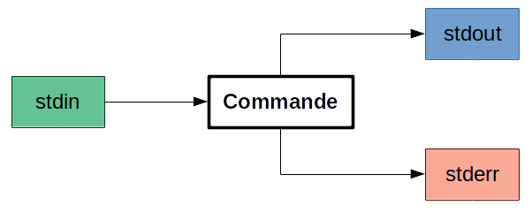
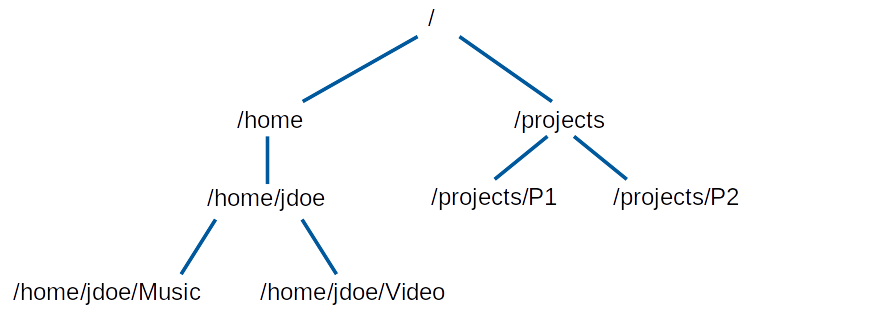
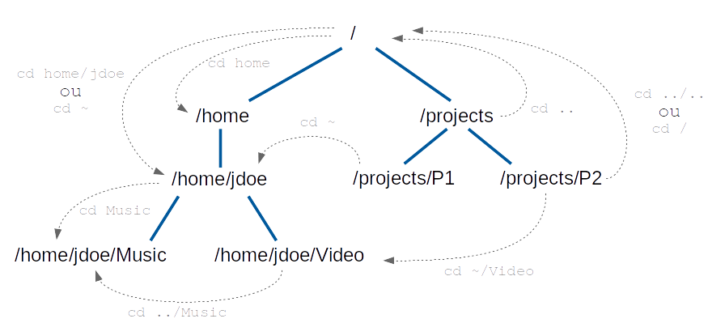

Sans devenir forcément expert(e), connaître quelques commandes de bases devient vite indispensable pour interagir avec une plateforme de bioinformatique.  

Il existe de nombreuses ressources pour se former à unix/linux.  
En voici quelques unes (liste loin d'être exhaustive):  

  - Page Wikipedia sur l'[interface en ligne de commande](https://fr.wikipedia.org/wiki/Interface_en_ligne_de_commande)  
  - Document de formation à UNIX sur la plateforme [bioinfo genotoul](http://genoweb.toulouse.inra.fr/~formation/unix/doc/Formation_LINUX_GenoToul.pdf)  
  - Une bonne introduction video en français aux [commandes unix de bases](https://www.youtube.com/watch?v=4jlPZtc17l8)  
  - Une liste détaillée des [principales commandes](https://doc.ubuntu-fr.org/tutoriel/console_commandes_de_base)
  - Un cours très complet d'[introduction à Linux](https://aful.org/ressources/formations/formation-introduction-linux/downloadFile/file/IntroductionLinux.pdf) qui va au delà des commandes des commandes de base


<br>

# Syntaxe et aide sur les commandes

## Syntaxe

La syntaxe générale d'une commande prend la forme:

```bash
commande [-options] [paramètres]
```

*ce qui est entre crochet `[]` est facultatif*

où:  

  - **commande** = ce que l'on veut faire  
  - **options** = comment le faire
  - **paramètres** = sur quoi on le fait


Quelques exemples:

  - `mkdir -p mydir`: créer un répertoire (vide) appelé `mydir` sans renvoyer une erreur si le répertoire existe (option `-p`)  
  - `cd mydir` : aller dans le répertoire `mydir`
  - `touch mytest.txt`: créer un fichier (vide) appelé `mytest.txt`
  - `ls -l` : affiche le contenu du répertoire courant, au format "long" (`-l`)
  - `ls -1` : affiche le contenu du répertoire courant, avec un élément par ligne (`-1`)
  - `tree` : même chose mais sous un format plus sympathique. Ici aucune option ou paramètre

<br>
Les longues commandes peuvent être séparées sur plusieurs lignes en plaçant un backspace `\` à la fin de chaque ligne (attention: `\` doit être le dernier caractère de la ligne, ne pas mettre d'espace après!):  
Ainsi:  `cp -R mydir mydircopy` peut s'écrire:  

```bash
cp \
  -R \
  mydir \
  mydircopy
```

Par sécurité on peut également terminer une commande par un point-virgule `;`:

```bash
cp \
  -R \
  mydir \
  mydircopy \
;
```

<br>
Pour certaines options, on dispose d'**abbréviations**. La version "longue" est précédée d'un double tiret `--` alors que la version courte est précédée d'un tiret unique `-`.  
Ainsi `ls --all` (l'option affiche tous les fichiers, y compris les fichiers "cachés" qui sont, sous unix, précédés par un point `.`) est parfaitement équivalent à `ls -a`  

<br>

> Le caractère `#` est utilisé pour précéder un commentaire, c'est à dire un texte qui n'est pas interprété comme une commande.
> ```bash
> # Une ligne de commentaire
> ls -l # Un commentaire en fin de ligne 
> ```

## Aide sur les commandes

La commande `man` permet d'obtenir le manuel d'une commande:  
```bash
man pwd
```
On peut également simplement taper `pwd command manual` sur son moteur de recherche pour trouver une [page d'aide](https://man7.org/linux/man-pages/man1/pwd.1.html) plus facile à lire.

Certaines commandes possèdent également une option `--help`, souvent raccourcie en `-h` (ainsi qu'une option `--version`):  

```bash
cat --help
cat --version
```

<br>

## flux standards et redirection
L'execution d'une commande peut impliquer 3 [flux standards](http://manpages.ubuntu.com/manpages/bionic/fr/man3/stdin.3.html), i.e. 3 flux d'échange de données (= de texte):



  - `stdin` est le flux d'entrée  
  - `stdout` est le flux de sortie  
  - `stderr` est le flux des messages d'erreur

Les flux `stdout` et `stderr` s'affichent par défaut dans le terminal mais il est possible de les rediriger.  
Pa exemple, la commande `ls` liste les fichiers ou dossiers présents dans un répertoire et renvoie cette liste dans `stdout`, c'est à dire affiche la liste des dossiers à l'écran.  
Mais on peut rediriger cette sortie vers une autre fonction en utilisant `|` (ALTGR + 6) appelé un **pipe** (prononciation [\\pajp\\](https://upload.wikimedia.org/wikipedia/commons/transcoded/4/4e/LL-Q150_%28fra%29-LoquaxFR-pipe.wav/LL-Q150_%28fra%29-LoquaxFR-pipe.wav.mp3)): 

```bash
ls | cat
```   


On peut également rediriger la sortie vers un fichier avec `>` : 

```bash
ls > monfichier.txt
```

Si le fichier `monfichier.txt` existe déjà, il sera écrasé.  
Pour ajouter le résultat de la commande `ls` à la fin du fichier `monfichier.txt` existant :  

```bash
ls >> monfichier.txt
```  

Tous les flux d'entré/sortie peuvent être redirigés, voire fusionnés, selon une  [syntaxe](https://fr.wikipedia.org/wiki/Interface_en_ligne_de_commande#Les_redirections_d'entr%C3%A9es/sorties) qui dépasse le cadre de ce document.

<br>
<br>

# Arborescence et navigation

## Arborescence

  - `/` est le répertoire racine (un peu comme `C:` sous Windows)  
  - Sous unix, votre répertoire "home" est typiquement `/home/<username>` mais sur l'IFB core ce sera `/shared/home/<username>`. Dans tous les cas, le symbole `~` correspond à votre répertoire "home"  
  - `.` est le répertoire courant (celui où l'on se trouve)
  - `..` est le répertoire parent (celui situé un cran au dessus dans l'arborescence)

Voici un exemple simple d'arborescence unix:  


La commande `cd` ("change directory") sert à se déplacer d'un répertoire à l'autre. Dans l'arborescence ci-dessus, on pourrait par exemple utiliser:  


La commande `pwd` renvoie le chemin du répertoire courant.  
Quand on utilise la commande `cd`, on peut utiliser un **chemin absolu** ou bien un **chemin relatif** (i.e. relatif au dossier courant).  
Par exemple, si je suis dans le répertoire `/projects/P1` et que je veux me rendre dans le répertoire `/home/jdoe`, je peux écrire:

  - `cd /home/jdoe` (chemin absolu)  
  ou bien
  - `cd ../../home/jdoe` (chemin relatif, sans grand intérêt ici...)  


## Naviguer dans les répertoires

  - `pwd` : pour savoir où on est
  - `cd <chemin_du_répertoire>` : pour changer de répertoire 
  - `ls` : pour lister les fichiers et répertoires

la commande `ls` a de nombreuses options et peut prendre un chemin particulier en paramètre.   
Quelques exemples:  

```bash
# simple listing du répertoire courant
ls
# listing d'un répertoire particulier
ls /home/jdoe
# un seul fichier par ligne
ls -1
# sortie longue
ls -l
# sortie longue et fichier cachés
ls -l -a
# que l'on peut aussi écrire
ls -la
# même chose en formatant la taille des fichier de manière plus sympathique
ls -lah
```

**Créer/effacer des répertoires**:  

  - `mkdir -p <chemin_du_répertoire>` pour créer un répertoire. L'option `-p` est recommandée
  - `rmdir <chemin_du_répertoire>` pour effacer un répertoire (à condition qu'il soit vide)
  - `rm -R <chemin_du_répertoire>` pour effacer un répertoire et tout ce qu'il contient (l'option `-R`, qui peut aussi s'écrire `-r` ou `--recursive`, applique la fonction `rm` de manière récursive sur tous les fichiers et sous-dossiers du répertoire).  
  
**Attention** à votre utilisation de la commande `rm`... elle efface...
  

<br>
<br>


# Manipuler des fichiers

## création de fichiers

On a vu comment créer:  

  - un fichier vide avec `touch`  
  - un fichier via la redirection de la sortie standard `stdout` d'une commande à l'aide du symbole `>` ou `>>` ("append"").  

On peut également directement ajouter du texte dans un fichier avec :  

```bash
echo "mon texte à ajouter" >> monfichier.txt
printf "%s\n" "mon autre texte à ajouter" >> monfichier.txt
```

La fonction [`printf`](https://fr.wikipedia.org/wiki/Printf) sert à formatter son argument, ici une chaine de caractère que l'on représente dans le format par **`%s`** et à laquelle on ajoute un retour à la ligne avec **`\n`**.  
Autre exemple avec 2 chaines de caractères séparées par une tabulation (`\t`):  

```bash
printf "%s\t%s" "texte1" "texte2" >> monfichier.txt
```

`printf` est une fonction très riche pour laquelle vous trouverez de nombreuses pages d'[aide et d'exemples](https://wiki.bash-hackers.org/commands/builtin/printf).  

<br>

Ajouter le contenu d'un fichier à la fin d'un autre fichier :  
```bash
cat monfichier.txt >> monNouveauFichier.txt
```

<br>

## Copie, déplacement et suppression

Ces commandes peuvent s'utiliser sur des fichiers ou des dossiers:

  - la commande `cp` pour copier des fichiers (`scp` pour copier via `ssh`):

```bash
cp <mon_fichier> <mon_répertoire_destination>
cp <mon_fichier> <mon_nouveau_fichier>
cp -r <mon_répertoire_source> <mon_répertoire_destination>
```

  - la commande `mv` pour déplacer un fichier. Notez que renommer un fichier est une forme de déplacement. On utilisera donc: `mv <mon_fichier> <mon_nouveau_fichier>`, que le nouveau fichier soit placé ou non dans le même répertoire.

  - la commande `rm` pour effacer. A utiliser avec précaution.

<br>

## Afficher / modifier le contenu d'un fichier

Pour examiner le contenu d'un fichier texte, on utilisera typiquement:  

  - `cat` renvoie le contenu du fichier dans la sortie standard `stdout` (attention si le fichier est très long....)  
  - `head` et `tail` pour afficher les premières et dernières lignes d'un fichier
  - `more` et `less` pour afficher progressivement le contenu d'un fichier

Pour en modifier le contenu, on pourra utiliser des éditeurs de texte en ligne de commande comme [`nano`](https://www.nano-editor.org/) (plus facile) , ou bien [`vim` / `vi`](https://www.vim.org/) (plus compliqué). Ces éditeurs sont relativement peu intuitifs à utiliser mais l'aide en ligne est riche. Si on y a accès, on préfèrera au début un éditeur avec une interface graphique comme [`gedit`](https://doc.ubuntu-fr.org/gedit).

Pour modifier un texte dans un flux (par exemple en enchainant des commandes), on utilisera généralement [`sed`](https://www.gnu.org/software/sed/manual/sed.html) ou [`awk`](https://fr.wikipedia.org/wiki/Awk). Là aussi, leur utilisation nécessite un apprentissage spécifique.

<br>
<br>

# Gestion des droits

A chaque fichier/dossier dans unix sont associés des droits en terme de:

  - **lecture** (**`r`** pour *read*)  
  - d'**écriture** (**`w`** pour *write*)   
  - d'**exécution** (**`x`** comme dans *execute*)  


Ces droits sont appliqués à 3 niveaux: 

  - l'**utilisateur** (**`u`** pour *user*)
  - le **groupe d'utilisateurs** (**`g`** pour *group*)
  - les **autres utilisateurs** (**`o`** pour *other*)  

Pour assigner les droits, on utilisera aussi l'abbréviation **`a`** pour *all* qui représente **tous les utilisateurs**  

Dans un répertoire test, créons des fichiers et un dossier puis listons le contenu du répertoire au format long (`ls -l`) :

```bash
mkdir -p tmpdir
cd tmpdir
touch fich1.txt fich1.mp3 fich2.txt fich21.txt
mkdir -p Music Video
ls -l
```

En fonction des réglages par défaut du serveur sur lequel vous travaillez vous n'aurez peut-être pas exactement les mêmes résultats.  


<br>

Pour régler les permissions, nous utilisons la commande [`chmod`](https://man7.org/linux/man-pages/man1/chmod.1p.html) (pour _**ch**ange **mod**e_).  
Référez-vous à la [page Wikipedia](https://fr.wikipedia.org/wiki/Chmod) qui explique très clairement l'utilisation de `chmod`.  

Quelques exemples (observez les résultats avec `ls -l`) :

```bash
# Ajouter les droits d'écriture au groupe :
chmod g+w fich1.txt
# Enlever les droits de lecture aux autres utilisateurs :
chmod o-r fich1.txt
# Ajouter les droits d'écriture de manière récursive dans un dossier à tous les utilisateurs:
chmod -R a+w Music
# Utilisation des codes en octal pour régler tous les droits (ici rwxr-xr--)
chmod 754 fich2.txt
```

<br>
<br>

# Wildcards / glob
Des caractères spéciaux ou ["wildcards"](https://en.wikipedia.org/wiki/Glob_(programming)) peuvent être utilisés pour spécifier des patterns qui représentent des ensembles de fichiers/dossiers.  

Commençons par créer quelques fichiers:  

```bash
touch fich1.txt fich1.mp3 fich2.txt fich3.txt fich4.txt fich21.txt 
```

  - **`?`** remplace un unique caractère
  ```bash
  ls -1 fich?.txt
  ```
  
  - **`*`** remplace 0, 1 ou plusieurs caractères
  ```bash
  ls -1 fich*.txt
  ls -1 *.txt
  ls -1 fich1.*
  ```

  - **`[]`** remplace un caractère dans une sélection
  ```bash
  ls -1 fich[1-3].txt # n'inclue pas fich21.txt
  ls -1 fich[124]*.txt # n'inclue pas fich3.txt
  ls -1 fich[!4]*.txt # n'inclue pas fich4.txt
  ```


<br>
<br>

# Autres commandes utiles

  - [`grep`](https://fr.wikipedia.org/wiki/Grep) pour rechercher des chaînes de caractères
  - [`find`](https://fr.wikipedia.org/wiki/Find) pour trouver des fichiers/dossiers
  - [`ln -s <source_file> <myfile>`](https://kb.iu.edu/d/abbe) pour créer des liens symboliques (équivalent des "raccourcis" sous Windows)
  - [`wget`](https://fr.wikipedia.org/wiki/GNU_Wget) et [`curl`](https://fr.wikipedia.org/wiki/CURL) pour télécharger des fichiers depuis internet
  - [`gzip` / `gunzip`](https://fr.wikipedia.org/wiki/Gzip) et [`tar`]() pour compresser/décompresser des fichiers
  
  ```bash
  # archiver le dossier Music en compressant les fichier avec gzip
  tar -cvzf music.tar.gz Music/
  # Décompresser l'archive
  tar -xvzf music.tar.gz /tmp
  ```

  - [`sort`](https://fr.wikipedia.org/wiki/Sort_(Unix)) pour trier des lignes de fichier
  
  ```bash
  # trier fichier1.txt par les valeurs (numériques -n) ascendantes présentes dans la 2ème colonne du fichier
  sort -k2 -n fichier1.txt
  ```
  
  - [`cut`](https://fr.wikipedia.org/wiki/Cut_(Unix)) pour récupérer des colonnes dans un fichier (mais `awk` est souvent plus adapté pour cela)
  - [`uniq`](https://fr.wikipedia.org/wiki/Uniq) pour supprimer les doublons
  
  ```bash
  # Trier les lignes de myfile selon le nombre de fois où elles apparaissent
  sort myfile | uniq -c | sort -n
  ```
  
  - [`du`](https://fr.wikipedia.org/wiki/Du_(Unix)) pour vérifier l'espace disque utilisé.
  
  ```bash
  # Taille globale occupée par le répertoire home (~)
  du -sbh ~
  ```
  
  - [`wc`](https://en.wikipedia.org/wiki/Wc_(Unix)) pour compter des caractères, des bytes ou des lignes dans un fichier.  
  
  ```bash
  # Nombre de lignes dans fich1.txt
  wc -l fich1.txt 
  ```
  
